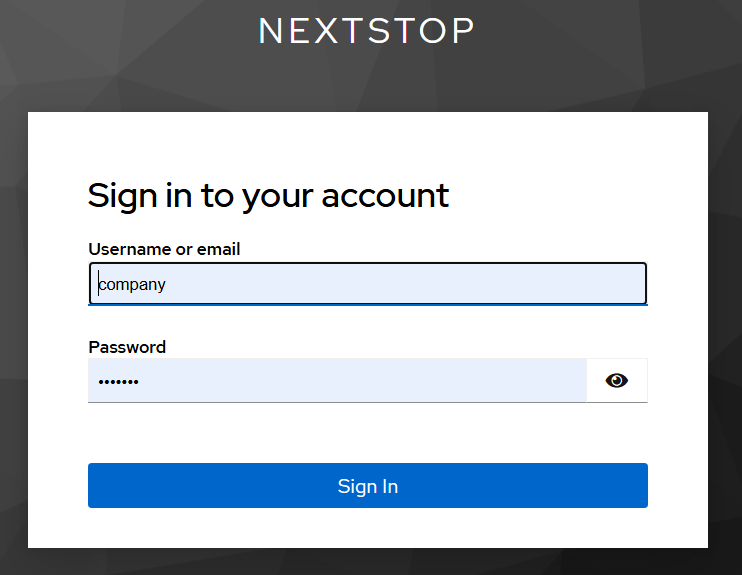
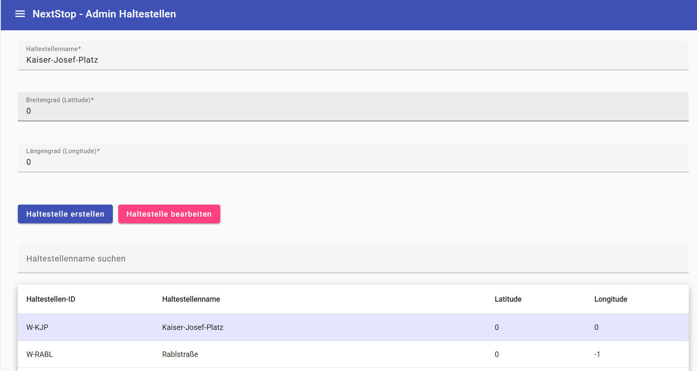
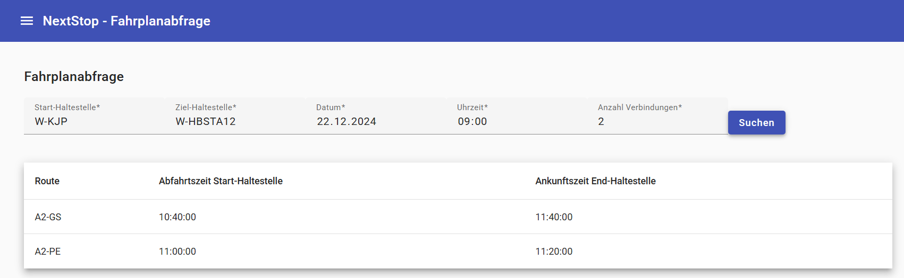

## 1. Inhaltsverzeichnis

- [2. Architektur](#2-architektur)
  - [Einstiegspunkt](#einstiegspunkt)
  - [Global](#global)
  - [App-Struktur](#app-struktur)
  - [Admin-Funktionen](#admin-funktionen)
  - [Übersicht der Komponenten](#übersicht-der-komponenten)
- [3. Navigationswege](#3-navigationswege)
- [4. Testlauf](#4-testlauf)
  - [Aufgabe 1 Login / Logout](#aufgabe-1-login--logout)
  - [Aufgabe 2 Feiertage und Schulferien](#aufgabe-2-feiertage-und-schulferien)
  - [Aufgabe 3 Haltestellen bearbeiten](#aufgabe-3-haltestellen-bearbeiten)
  - [Aufgabe 4 Routen erstellen](#aufgabe-4-routen-erstellen)
  - [Aufgabe 5 Haltestellen suchen](#aufgabe-5-haltestellen-suchen)
  - [Aufgabe 6 Fahrplanabfragen](#aufgabe-6-fahrplanabfragen)
  - [Aufgabe 7 Anzeigetafeln](#aufgabe-7-anzeigetafeln)
  - [Aufgabe 10 Verspätungsstatistik Tabelle](#aufgabe-10-verspätungsstatistik-tabelle)
  - [Aufgabe 11 Verspätungsstatistik Diagramme](#aufgabe-11-verspätungsstatistik-diagramme)
- [5. Diverse Fragen](#5-diverse-fragen)
  - [5.a) URL Änderung](#5a-url-änderung)
  - [5.b) Bestimmte Seiten nur nach Login zugreifbar](#5b-bestimmte-seiten-nur-nach-login-zugreifbar)
  - [5.c) Validierung Dateneingabe](#5c-validierung-dateneingabe)
  - [5.d) Backend Fehler](#5d-backend-fehler)
- [6. Setup](#6-setup)
  - [Technologien und Werkzeuge](#technologien-und-werkzeuge)
  - [Ausführung](#ausführung)
- [7. Externe Teile](#7-externe-teile)
  - [Angular Core Modules](#angular-core-modules)
  - [Angular Material](#angular-material)
  - [RxJS](#rxjs)
  - [HTTP-Client](#http-client)
  - [Keycloak](#keycloak)
- [8. Nicht implementierte Features](#8-nicht-implementierte-features)

## 2. Architektur

Die Anwendung ist eine webbasierte Plattform, entwickelt mit Angular, und dient der 
Verwaltung von Fahrplänen, Haltestellen und Routen für den öffentlichen Nahverkehr.

**Einstiegspunkt**

* `main.ts`: Startet die Anwendung mithilfe der Angular-Funktion `bootstrapApplication`, 
die die `AppComponent` als Root-Komponente verwendet.

**Global**

* `styles.css`: Definiert globale Styling-Einstellungen. Vor allem für die Navigationsleiste 
links, die auf allen Seiten vorhanden ist.
* `app.component.html` und `app.component.ts`: Enthalten den Code für die linke Navigationsleiste, 
die zu allen anderen Seiten führt.
* `app.routes.ts`: Definiert alle Routen.

**App-Struktur**

*	`Ordner components`: Hier befinden sich die Angular Komponenten. Dort findet man den HTML-Code
angereichert mit den Angular-Funktionen für die Darstellung. In der dazugehörigen TypeScript-Datei die 
ganzen Importe, Variablen, Formen, viel Validierungslogik und der Aufruf des Service um mit dem Backend zu kommunizieren.
*	`Ordner services`: Hier befinden sich die Angular Services. Hier sind die Methoden für die 
Kommunikation mit dem Backend definiert wie create, update, delete etc. Trennen die Geschäftslogik von den Komponenten, um eine klare wiederverwendbare Architektur zu gewährleisten.
* `Ordner routing`: Hier befinden sich der Code zur Verwaltung der Routen. Mit Hilfe von Guards wurden die URLs auch abgesichert gegen unzulässigen Zugriff durch falsche Benutzer.

**Admin-Funktionen**

*	Dateien und Ordner mit dem Präfix `admin-` sind ausschließlich für angemeldete Administratoren von Transportfirmen zugänglich.
*	Diese Komponenten und Services verwalten administrative Aufgaben, wie das Hinzufügen von Haltestellen oder das Bearbeiten von Routen.

**Übersicht der Komponenten**

## 3. Navigationswege

Durch die globale Navigationsleiste links, ist jede Seite von jeder Seite aus erreichbar. 
Diese Leiste lässt sich durch einen Klick auf den Hamburger Menu Button ein- und ausblenden.

## 4. Testlauf

Aufgabe 8 und 9 fehlen hier absichtlich.
Aufgabe 8 gibt es nur im Backend. Aufgabe 9 ist nur eine Information, die
Verspätungen auch in den anderen Aufgaben zu berücksichtigen.

### Aufgabe 1 Login / Logout

Navigationsleiste, noch nicht angemeldet:

Login Dialog über Authentifizierungsservice Keycloak:

Navigationsleiste angemeldet:

### Aufgabe 2 Feiertage und Schulferien

Die Liste der Feiertage erscheint automatisch als Tabelle, wenn man die entsprechende Seite öffnet 
und wird auch nach jeder schreibenden Aktion aktualisiert.

Neuer Feiertag erstellt und wird automatisch in der Tabelle unten angezeigt:

Hier wird ein Feiertag bearbeitet und der Name geändert:

Eine besondere Komfort-Funktion in der Tabelle ist, dass man eine Zeile anklicken kann und
die Daten dann automatisch in die Eingabefelder geladen werden. So kann man sehr einfach
Feiertage editieren:

Neuen Feiertag wieder löschen:

### Aufgabe 3 Haltestellen bearbeiten

Auf dieser Seite kann man Haltestellen erstellen und bearbeiten. Hier wird eine neue Haltestelle 
erstellt:

Als Komfort-Funktion, zeige ich auch unter den beiden Buttons eine Tabelle mit allen 
Haltestellen an, damit man sich gleich überzeugen kann, dass diese auch wirklich eingefügt wurde.
Hier kann man auch nach dem Namen suchen.

Bearbeiten geht natürlich auch.

Für das Bearbeiten gibt es eine Komfort-Funktion, dass man Einträge in der Tabelle anklicken kann und
dann die Daten automatisch in die Eingabefelder übertragen werden, um ein einfaches anpassen zur ermöglichen.

### Aufgabe 4 Routen erstellen

Auf dieser Seite kann man Routen erstellen. Dabei gibt man zuerst die Daten der Route selbst an.
Danach kann man mit dem Button "Haltestellen hinzufügen" weitere Haltestellen ergänzen.
Sollte man einen Fehler gemacht haben, kann man mit dem Button "Entfernen" jede Haltestelle
auch einzeln wieder entfernen.

### Aufgabe 5 Haltestellen suchen

Auf dieser Seite können Haltestellen nach dem Namen gesucht werden. Dabei muss der Name nicht
exakt richtig geschrieben werden. Es wird der levenshtein-Algorithmus verwendet mit einer
eingestellen Distanz von 2. Es darf also zwei Änderungen geben (Zeichen hinzugefügt, entfernt oder
verändert). Dadurch matchen mehrere Test Hagenberg Einträge. Die Ergebnisse werden laufend beim
Tippen aktualisiert mit einer Debounce-Time von 300ms.

Durch ein Synonym-Wörterbuch werden auch unterschiedliche Schreibarten wie St. und Sankt erkannt:

Durch einen Radio Button kann man zur Suche nach dem Standort wechseln. Hier werden dann 10
der nähesten Haltestellen zurückgeliefert und nach der Entfernung sortiert. Bei der Distanzberechnung
wurde sogar die Erdkrümmung berücksichtigt.

### Aufgabe 6 Fahrplanabfragen

Auf dieser Seite können Fahrplanabfragen durchgeführt werden. Dabei wird angezeigt, wie die Route
der Verbindung heißt und wann die Abfahrtszeit auf der Start-Haltestelle ist und die Ankunftszeit
bei der End-Haltestelle.

### Aufgabe 7 Anzeigetafeln

Auf dieser Seite kann man sich die nächsten Abfahrten für eine Haltestelle anzeigen lassen, 
inklusive aktueller Verspätung.

### Aufgabe 10 Verspätungsstatistik Tabelle

Auf dieser Seite sieht man die Verspätungsstatistiken. Hierbei muss man ein Start- und 
Enddatum auswählen, dann erhält man die Daten für alle Routen. Wenn man optional eine Route-ID
angibt, erhält man die Statistik für nur diese eine Route.

### Aufgabe 11 Verspätungsstatistik Diagramme

Auf derselben Statistikseite, unter der Tabelle sieht man die grafischen Darstellungen der 
Verspätungsstatistiken. Zuerst sieht man in einem Balkendiagramm die durchschnittliche Verspätung 
aller Routen im Vergleich. Danach folgen Tortendiagramme um zu sehen wie viele CheckIns wie stark
verspätet waren. 

Durch das auszuwählende Start- und Enddatum kann man auch leicht sich Auswertungen einer bestimmten
Woche, Monat oder Jahr anzeigen lassen.

## 5. Diverse Fragen

### 5.a) URL Änderung
Falls sich die URLs ändern, wäre der notwendige Eingriff minimal invasiv. 
Im Ordner `app` sind in der Datei `app.routes.constant.ts` die URLs 
als Konstanten definieren udn global exportiert. Diese Konstanten werden
dann in den entsprechenden Klassen verwendet. Somit ist nur eine Ändderung an einer Stelle notwendig.

Globale Konstanten:

Beispielhaft die Verwendung in `app.component.ts`:

### 5.b) Bestimmte Seiten nur nach Login zugreifbar

Durch die Methode `getRole()` im `authentication.service.ts` wird die aktuell angemeldete Rolle 
aus dem JWT Token ausgelesen. Durch Route-Guards in `app.routes.ts` wird sichergestellt, 
dass bestimmte Seiten nur erreichbar sind, wenn ein Admin angemeldet ist.

Weiters werden in der UI, die Buttons zu diesen Seiten ausgeblendet, wenn kein entsprechender Benutzer
angemeldet ist.

Außerdem wird man bei einem Wechsel der Rolle zuerst einmal automatisch auf eine Seite
weitergeleitet, die öffentlich zugänglich ist.

### 5.c) Validierung Dateneingabe

In der Anwendung gibt es viele Validierungsmechanismen um eine korrekte Dateneingabe
durch den User zu gewährleisten. 

Eine verwendete Möglichkeit sind benutzerdefinierte Methode, die entweder eine
Fehlermeldung als String zurückliefern oder null wenn kein Fehler vorliegt.
Hier ein Beispiel aus `stops.component.ts`:

Das wie folgt in `stops.component.html` verwendet wird:

Somit wird in der UI sofort bei der Eingabe eine sinnvolle Fehlermeldung angezeigt 
und der Suchen-Button deaktiviert. Diese Kombination aus eindeutiger Fehlermeldung bei
der Eingabe und deaktivieren des Buttons liefert eine sehr hohe Benutzerfreundlichkeit.

Gültige Eingabe:

Eine weitere Möglichkeit, die ich ausprobiert habe, war es eine FormGroup in
der UI zu verwenden und dort für die Eingabe-Felder Validatoren hinzuzufügen.

In dem folgenden Beispiel aus `admin-stops.component.ts` sieht man derren 
Verwendung. Es wurden sowohl vorhandene Methoden genutzt wie `min()` und
`max()` als auch eine benutzerdefinierte Methode `noSpecialCharsValidator` 
mit regex Ausdruck.

Diese Validierung wird dann im HTML-Code mit `.invalid` auf Gültigkeit abgefragt
und mit `.touched` ob der Fokus bereits im Eingabefeld war. Hier kann dann auch 
im `<mat-error/>` Tag eine benutzerdefinierte Fehlermeldung ausgegeben werden.

Hier sieht das Ergebnis in der UI. Was mir an dieser Lösung besonders gefällt,
ist dass man auch abfragen kann ob der Fokus schon einmal im Eingabefeld war mit
`.touched`. Dadurch kann man sehr gut erforderliche Felder markieren die übersprungen wurden.

### 5.d) Backend Fehler

Im Backend wurde versucht, möglichst viele Fehler- und Spezialfälle zu berücksichtigen. 
In diesen Fall, sollte eine sinnvolle Fehlermeldung und Status-Code als Response 
zurückgeliefert werden. Beispielweise beim Einfügen einer Haltestelle existiert diese
ID bereits:

Hier wird beispielweise in `admin-stops.component.ts` bei einem Fehler der Statuscode 
unterschieden und eine entsprechende Fehlermeldung gesetzt.

Diese wird dann natürlich auch im UI angezeigt:

## 6. Setup

### Technologien und Werkzeuge

**Framework:** Angular v19.0.6

**Programmiersprache:** Typescript und HTML

**IDE/Editor:** WebStorm v2024.3

**Laufzeitumgebung:** Node.js v22.11.0

**Packetmanager:** npm v10.9.0

### Ausführung

Im Projekt wird die Anwendung mit folgendem Befehl ausgeführt:

`ng server`

Die Anwendung wird standardmäßig unter `http://localhost:4200` bereitgestellt.

## 7. Externe Teile

In der Anwendung wurden folgende externe Abhängigkeiten verwendet:

### Angular Core Modules

* `@angular/route`: Für die Navigation und das Routing innerhalb der Anwendung
* `@angular/forms`: Für die Verwaltung von Formularen und Validierungen.

### Angular Material

Wurde verwendet für UI-Komponenten wie `MatSidenav`, `MatTable` und `MatFormField`
für eine moderne Benutzeroberfläche. Dabei wurde das Theme `indigo-punkt` verwendet.

### RxJS

Für die Verarbeitung von Observables und asynchronen Datenströmen, z.B. für die
`debounceTime` bei der Vorschlagsuche nach Haltestellen. Dadurch wird nicht sofort 
bei jedem Tastenschlag ein Request abgeschickt.

### HTTP-Client

Angulars `HttpClientModule` wird verwendet, um die API-Aufrufe zu realisieren in den
verschiedenen Services wie `stop.service.ts`.

### Keycloak

Keycloak wird verwendet, um die Authentifizierung und Autorisierung in der 
Anwendung zu implementieren. Es ermöglicht Single Sign-On (SSO) und 
rollenbasierte Zugriffskontrolle. Bestimmte Routen und Funktionen werden
basierend auf Benutzerrollen geschützt.

## 8. Nicht implementierte Features

Ich habe noch einmal gründlich die Angabe durchgelesen und mit meiner Lösung verglichen. Ich hoffe, ich habe nichts übersehen aber ich denke es ist soweit alles umgesetzt worden.
